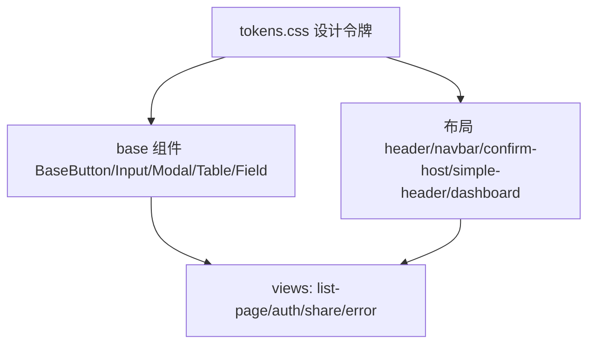

## 用户需求

深度熟悉 `stitch_document_driven_page_design` 设计稿后，按设计稿执行 R Pan 前端改造，先产出详细计划。

## 产品概述

R Pan 私人分布式存储系统的前端门户。设计稿以「极简专业风（Linear/Vercel/Raycast）」为目标，要求 Vue 3.5 + Tailwind v4（CSS 令牌驱动）+ @lucide/vue 图标 + light/dark/system 三态主题（根节点 class="dark" 切换），每页必须同时呈现亮色与暗色两套视觉。

## 核心特性（本轮改造范围）

- **修复 Base 基础组件亮色模式失效缺陷**：当前 BaseButton/BaseInput/BaseModal/BaseTable/BaseField 的配色仅在 `dark:` 下生效，亮色模式按钮无背景、无文字色；同时写死十六进制未走 `var(--color-*)` 令牌。需补齐亮色分支并统一走令牌，这是全站复用件，修好后大量页面自动受益。
- **令牌化 24 个残留硬编码文件**：将内联 / Tailwind 任意值 / scoped CSS 中的十六进制色值替换为 `var(--color-*)` 令牌，确保亮色与暗色双套同时正确呈现；内联 `style` 必须改为令牌类（否则无法响应 `.dark`）。
- **重做 simple-header 组件**：当前为纯旧版 scoped CSS（白底 62px、40px 红色标题 `#f56c6c`、无暗色、无主题切换），改为 Tailwind 令牌化头部（品牌 + 主题切换按钮），与设计系统对齐；仅影响 share 与 forget 两页。
- **重做 404 错误页**：当前配色几乎全硬编码，参照已改造的 500 页范本，使用令牌化实现大号 404（`--text-9xl` + primary 低透明度）+ 标题 + 副文案 + 返回首页按钮。
- **清理 confirm-host 残留硬编码**：danger 图标底、输入框边框/错误色仍硬编码，prompt 输入框未复用 BaseInput，需令牌化并复用。
- **统一 8 个 list-page 页面的工具条/视图切换内联硬编码**，保证双主题生效。

## 视觉约束（执行铁律）

- `code.html` 产物仅为视觉参考（布局/间距），其使用的 Tailwind v3 CDN 与 Material Symbols 图标 **一律不引入**；实现以 Markdown 总纲 + 现有 Tailwind v4 令牌为准，图标统一用 @lucide/vue。
- 不改动已完成的预览页与浮层（避免回归）；不新增令牌（tokens.css 已覆盖全部色值）。

## 技术栈选择

- 框架：Vue 3.5 + TypeScript + Vite（沿用）
- 样式：Tailwind CSS v4（CSS-first `@theme`），令牌单一真相源 `src/styles/tokens.css`（沿用）
- 图标：@lucide/vue（stroke-width 2，沿用）
- 状态/主题：Pinia + `useTheme.ts`（light/dark/system，localStorage key `x-pan:theme`，挂载前 `initTheme()` 防 FOUC，沿用）
- 不引入：element-plus、Material Symbols、Tailwind v3

## 实现方案

整体采用「自下而上、先基础后页面」策略：先修复 5 个 Base 组件（亮色分支 + 令牌化），因其被全站复用，修复后页面层改动量大幅下降；再令牌化布局组件（header/navbar/confirm-host/simple-header/dashboard），最后令牌化 8 个 list-page 与 3 个认证/分享/404 页面。

关键技术决策：

1. **Base 组件双主题补齐**：在 `variantClass`/`sizeClass` 中同时提供亮色 `bg-[var(--color-primary-500)]` 与 `dark:bg-[var(--color-primary-500)]` 两套（色值一致，依赖令牌在 `.dark` 下自动切换）。焦点环改为 `--color-ring` 令牌，去除 `dark:` 前缀。这样无需维护两份色值，且天然支持 system 跟随。
2. **内联 style 令牌化**：对 `list-page/file` 等内联 `style="border-color:#262626;background-color:#181b23"` 改为 `border-[var(--color-border)] bg-[var(--color-surface-container-low)]` 类，使 `.dark` 生效。
3. **simple-header 重做**：参照 `header/index.vue` 的令牌化写法，品牌区 64px、主题切换按钮复用 `useTheme().toggle`，删除旧 scoped CSS。
4. **404 页参照 500 页**：复用 `BaseButton` + `Lucide Home` 图标 + `--text-9xl`/primary 低透明度，删除全部硬编码。

## 性能与可靠性

- 仅做样式/令牌替换，无新增运行时逻辑，不影响打包体积与首屏性能。
- 令牌替换是纯静态类名变更，无 N+1 / 重复遍历风险。
- 暗色切换仍由根 `class="dark"` + CSS 变量驱动，无需 JS 重渲染。
- 回归控制：不触碰已完成的 preview/* 与浮层组件；改动集中在样式层，业务逻辑（stores/composables/api）不动。

## 实现笔记

- 色值映射（批量替换，不新增令牌）：`#0070f3`→`--color-primary-500`、`#0060d8`→`--color-primary-600`、`#aec6ff`→`--color-primary-200`、`#ef4444`→`--color-danger`、`#f59e0b`→`--color-warning`、`#10b981`→`--color-success`、`#ededed`/`#171717`→`--color-text`、`#a1a1a1`/`#737373`→`--color-text-muted`、`#262626`→`--color-border`、`#404040`→`--color-border-strong`、`#0a0a0a`→`--color-surface`、`#181b23`→`--color-surface-container-low`、`#272a32`→`--color-surface-container-high`、`#32353d`→`--color-surface-container-highest`、`#000`→`--color-bg`(dark)、`#f56c6c`/`#ca4e00`→`--color-tertiary-container`。
- 焦点环统一 `focus-visible:ring-2 focus-visible:ring-[var(--color-ring)] focus-visible:ring-offset-2 focus-visible:ring-offset-[var(--color-bg)]`，去掉 `dark:` 前缀。
- 验收：切主题逐页核对亮/暗双套；用 `search_content` 复查剩余 `#xxxxxx` 硬编码是否在清单外新增。

## 架构设计

维持现有分层：tokens.css（单一令牌源）→ base 组件 / 布局组件 → views 页面。本次为样式层收尾，不调整目录结构与路由。



## 目录结构与文件清单

```
src/
├── styles/tokens.css                       # 沿用，不改动（已覆盖全部色值）
├── components/base/
│   ├── BaseButton.vue                       # [MODIFY] 补亮色分支 + 令牌化 + 焦点环去 dark:
│   ├── BaseInput.vue                        # [MODIFY] 令牌化 input/error/focus
│   ├── BaseModal.vue                        # [MODIFY] 遮罩/卡片令牌化，双主题
│   ├── BaseTable.vue                        # [MODIFY] 表头/行 hover/选中令牌化
│   └── BaseField.vue                        # [MODIFY] label/error/hint 令牌化
├── components/
│   ├── header/index.vue                     # [MODIFY] 残留硬编码 token 化
│   ├── navbar/index.vue                     # [MODIFY] 令牌化，去内联
│   ├── simple-header/index.vue              # [MODIFY] 重做为令牌化头部+主题切换
│   ├── confirm-host/index.vue               # [MODIFY] danger 图标底/输入框边框令牌化，prompt 复用 BaseInput
│   └── dashboard/
│       ├── DashboardCards.vue               # [MODIFY] 令牌化
│       └── DashboardCharts.vue              # [MODIFY] 令牌化（SVG 用 currentColor/令牌）
├── views/
│   ├── login/index.vue                      # [MODIFY] 令牌化（左右分栏）
│   ├── register/index.vue                   # [MODIFY] 令牌化
│   ├── forget/index.vue                     # [MODIFY] 令牌化（依赖 simple-header）
│   ├── share/index.vue                      # [MODIFY] 令牌化（依赖 simple-header）
│   ├── error/404/index.vue                  # [MODIFY] 参照 500 重做，令牌化
│   └── list-page/
│       ├── file/index.vue                   # [MODIFY] 工具条/视图切换内联 style 令牌化
│       ├── doc/index.vue                    # [MODIFY] 同 file 模式
│       ├── img/index.vue                    # [MODIFY] 薄包装令牌化
│       ├── video/index.vue                  # [MODIFY] 薄包装令牌化
│       ├── music/index.vue                  # [MODIFY] 薄包装令牌化
│       ├── share/index.vue                  # [MODIFY] 令牌化
│       ├── recycle/index.vue                # [MODIFY] 令牌化
│       └── offline/index.vue                # [MODIFY] 令牌化
```

## 关键代码结构（无新增类型，复用既有）

无需新增接口或类型定义；全部为既有组件样式替换。

## 设计风格

极简专业风（Linear/Vercel/Raycast）：大量留白、克制用色、清晰字体层级、微动效精准、暗色模式一等公民。所有页面必须同时呈现 light/dark 双套，亮/暗由根节点 `class="dark"` 切换。

## 页面设计稿（依据 Markdown 总纲，非 HTML 产物）

### 1. 认证页（login/register/forget）

- 桌面：左半品牌渐变区（primary-600→primary-800 + 光斑）+ 右侧表单区（BaseField+BaseInput+BaseButton），圆角 8/12/16，动效 150/240ms。
- 移动（≤768）：隐藏品牌区，表单全宽 p-6。
- 三色：primary-500 主按钮、danger 校验、warning 密码强度中。
- 交互：Enter 提交、loading 态、ElMessage 顶部居中 Toast、focus-visible 焦点环。

### 2. list-page（file/doc/img/video/music/share/recycle/offline）

- 顶部：FileTypeFilter chips + 工具条（上传/新建文件夹 + 列表/网格视图切换）。
- 中部：面包屑 + Dashboard 卡片/图表（仅根目录）+ FileTable（列表/网格双视图）。
- 拖拽上传遮罩：dashed border primary，backdrop-blur。
- 移动：Navbar 转抽屉、列表转网格、副标题隐藏。

### 3. simple-header（share/forget 头部）

- 64px 令牌化头部：品牌 Logo（primary）+ 标题 + 右侧主题切换（Sun/Moon）+ 用户信息。无导航。

### 4. 404 页

- 全屏居中：大号 404（`--text-9xl`，`text-[var(--color-primary)]/20` 装饰）+ 标题「页面不存在」+ 副文案 + BaseButton primary（Home 图标）返回首页。背景 `var(--color-bg)`，微妙几何纹理。

## 全局规范

- 焦点环：`outline 2px solid var(--color-ring)`，offset 2px。
- 滚动条：8px、thumb `var(--color-border-strong)`、hover `var(--color-text-muted)`。
- 数字等宽：tabular-nums。
- 路由过渡：route-fade 240ms。
- 配额阈值：<70% primary / 70-90% warning / ≥90% danger。